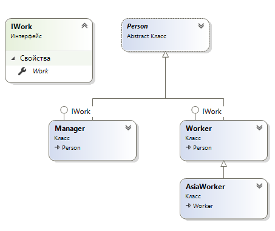
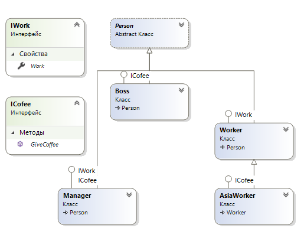
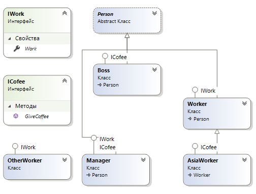

# Интерфейсы (итераторы, клонирование, сравнение)

В языке C# интерфейсный тип представляет собой именованный набор абстрактных членов. А абстрактные тедоты являются протоколом без реализации. Интерфейс выражает поведение, которое заданный класс или структура может поддерживать. Класс или структура может реализовывать сколько угодно интерфейсов и поддерживать множество линий поведения.

>Все имена интерфейсов нужно начинать с заглавной буквы I - такое соглашение.

В отличие от абстрактного класса интерфейсные типы могут содержать только определения членов. Полиморфный интерфейс абстрактного класса поддерживается только призводными типами от базового. А полиморфный интерфейс может быть реализован любым классом либо структурой, в любой иерархии и внутри любого пространства имен или сборки.

## Определение

В отличие от классов для интерфейсов никода не задается базовый класс. Для членов интерфейса никогда не указываются модификаторы доступа (так как все они неявно открытые и абстрактные).

Интерфейс - это протокол и реализация для него не предоставляется - за нее отвечает поддерживающая его класс или структура. В интерфейсе позволяется определять любое количество прототипов как методов, так и свойств.

Пример определения простейшего специального интерфейса:
```csharp
interface ISample
{
    //неявно открытый и абстрактный
    int GetNumberOfSample();
    //свойства
    int propTest { get; set; }
    int propSet { set; }
    int protGet { set; }
}
```
Интерфейсы не привносят ничего особого до тех пор, пока не будут реализованы классом или структурой.

Многие стандартные интерфейсы уже определены у различных типов платформы .NET. Интерфейс .NET под названием ICloneable из пространства имен System реализован очень многими типами. Такие типы можно обработать полиморфным образом последством этого интерфейсного типа:
```csharp
int[] abc = {10, 20};
object theClone = abc.Clone();
```

## Реализация

При расширении функциональности класса путем поддержки интерфейса к его определению добавляется после указания базового класса, если он есть, через запятую список нужных интерфейсов.

Примеры различных определений с интерфейсом:
```csharp
public class Sampl : ISample
{ /* code */ }
public class SamplCl : object, ISample
{ /* code */ }
public class SamplPo : Base, ISample, ICloneable
{ /* code */ }
public struct SamplSt : ISample, ICloneable
{ /* code */ }
```
Поддерживающий реализацию класс или структура должны либо не иметь возможности выборочно решать, какие члены он будет реализовать, либо реализовать все члены интерфейса.

Пример реализации интерфейса различными связанными классами:
```csharp
interface IWork
{
    int Work { get; } //все должны работать
}
public abstract class Person
{
    public int Money { get; set; } = 0;
    public abstract void GiveBonus(int num);

}
class Manager : Person, IWork
{
    public override void GiveBonus(int num)
    {
        Money += num * 10;
    }
    public int Work => 100; //очень много работает
}
class Worker : Person, IWork
{
    public override void GiveBonus(int num)
    {
        Money += num / 10;
    }
    public virtual int Work => 50; //так себе работает
}
class AsiaWorker : Worker
{
    public sealed override void GiveBonus(int num)
    {
        base.GiveBonus(num / 100); //гастарбайтерам еще меньше бонусов
    }
    public override int Work => 0; //совсем не работает
}
```

Иерархия вместе с интерфейсами.

 


# Использование членов интерфейсов

Если члены интерфейса не реализованы явно, то к членам интерфейса можно обращатся напрямую на уровне объекта. Пример:
```csharp
Worker worker = new Worker();
int work = worker.Work;
```
Однако если тип не поддерживает интерфейсом, то генерируется исключение InvalidCastException. Пример обработки:
```csharp
Freedom freedom = new Freedom();
try
{
    int work = ((ISample) freedom).Work(); //у бомжа совcем нет свойства работать!!!
}
catch (InvalidCastException ex)
{
    WriteLine(ex.Message);
}
```

Но так лучше не делать, есть способы определить поддерживается ли интерфейс объектом или нет до обращения к членам интерфейса, реализованным в объекте.

Используя ключевое слово as можно определить, трактуется ли объект как указанный интерфейс, и если да то возвращается ссылка на интересующий интерфейс, а если нет, то ссылка на null. И перед продолжением нужно проверить результат на null:
```csharp
Worker worker = new Worker();
IWork work = worker as IWork;

if (work != null)
    WriteLine($"Работа: {work.Work}");
else
    WriteLine("Это не работник!");
```

Можно еще и проверять используя ключевое слово is. Если интересующий объект не совместим с указанным, то возвращается значение false, если же совместим с интерфейсом - true, то можно безопасно обращаться к его членам. Тут уже без проверки на null:
```csharp
Person[] persons = { new Manager(), new Worker(), new AsiaWorker() };
foreach (var item in persons)
{
    if (item is IWork work)
        WriteLine($"Work = {work.Work}");
    else
        WriteLine($"It is no work!");
    WriteLine($"Money = {item.Money}$");
}
```

# Интерфейсы в определениях методов

Интерфейсы можно использовать как параметры в методах. Так как интерфейсы - это типы, то можно строить методы, которые принимают интерфесы в качестве параметров.

Пример добавления еще одного специфического интерфейса в иерархию классов:
```csharp
interface ICofee
{
    void GiveCoffee(); //только элите можно пить кофе
}
```
И лишь избранным их всей иерархиии реализовать новый интерфейс:
```csharp
class Boss : Person, ICofee
{
    public void GiveCoffee()
    {
        WriteLine("Ammm Cofee!");
    }
    public override void GiveBonus(int num)
    {
        Money *= 9999; //гребет все деньги компании
    }
}
```

Та-же иерархия с дополнительным интерфейсом.

 


Теперь можно создать новый метод который будет работать с таким интерфейсом:
```csharp
//раздача всем кому положено кофе
static void CoffeeBrake(ICofee cofee)
{
    WriteLine("Cofee:");
    cofee.GiveCoffee();
}
```
Использование этого метода:
```csharp
Person[] persons = { new Boss(), new Manager(), new Worker(), new AsiaWorker() };
foreach (var item in persons)
{
    if (item is ICofee cofee) //положено ли ему кофе пить?
        CoffeeBrake(cofee); //раздача всем кому положено кофеев
}
```

Интерфейсы можно применять в качетсве типов возвращаемых значений методов. Пример:
```csharp
//срочный поиск любого работника
static IWork AnyWorker(Person[] persons)
{
    foreach (Person elem in persons)
    {
        if (elem is IWork work)
            return work;
    }
    return null;
}
```
Использование:
```csharp
Person[] persons = { new Boss(), new Manager(), new Worker(), new AsiaWorker() };
IWork worker = AnyWorker(persons);
WriteLine("Fast work => " + worker.Work);
```

## Массивы интерфейсных типов

Из интерфейсов можно формировать массивы из несвязанных по наследованию объектов. Пример нового класса с реализованным в нем интерфейсом:
```csharp
class OtherWorker : IWork
{
    public int Work => 200; //отличный работник!
}
```
Использование:
```csharp
//только работники которые умеют работать, босс сюда не относится
IWork[] workers = { new Manager(), new OtherWorker(), new AsiaWorker(), new Worker() };
foreach (IWork item in workers)
{
    if (item is Worker worker)
        WriteLine("WORK!!!");
    WriteLine("Work = " + item.Work);
}
```

Та-же иерархия с посторонним классом.

 

## Явная реализация интерфейсов

Когда класс или структура реализует несколько интерфейсов с идентичными именами членов, возникают проблемы конфликта имен. 

Пример простых объявлений интерфейсов и класса:
```csharp
interface IDrawToForm
{
    void Draw();
}
interface IDrawToPrinter
{
    void Draw();
}
class Sample : IDrawToForm, IDrawToPrinter
{
    public void Draw()
    {
        WriteLine("draw");
    }
}
```
При использовании все обращения приводят к вызову одного и того же метода:
```csharp
Sample sample = new Sample();
((IDrawToForm)sample).Draw();
((IDrawToPrinter)sample).Draw();
```
Явно реализованные члены интерфейсов будут закрытыми, для доступа к ним нужно приводить к конктектному интерфейсу всегда. Пример объявлений интерфейсов и класса с явной реализацией:
```csharp
interface IDrawToForm
{
    void Draw();
}
interface IDrawToPrinter
{
    void Draw();
}
class Sample : IDrawToForm, IDrawToPrinter
{
    void IDrawToForm.Draw()
    {
        WriteLine("draw form");
    }
    void IDrawToPrinter.Draw()
    {
        WriteLine("draw printer");;
    }
    public void Draw()
    {
        WriteLine("simple draw");
    }
}
```
Теперь при использовании обращения приводят к вызову разных методов:
```csharp
    Sample sample = new Sample();
    ((IDrawToForm)sample).Draw(); //draw form
    ((IDrawToPrinter)sample).Draw(); //draw printer
    sample.Draw(); //sample draw
    IDrawToForm idtform = (IDrawToForm) sample;
    idtform.Draw(); //draw form
    if (sample is IDrawToPrinter printer)
        printer.Draw(); //draw printer
```

## Иерархии интерфейсов

Интерфейсы поддерживаются организацию в иерархии подобно классам, но в отличие от них производный интерфейс может дополнять собственное определение членов дополнительными унаследованными. Это пригодится когда нужно расширить функциональность имеющегося интерфейса, не нарушая работу существующих кодовых баз.

Пример определений интерфейсов:
```csharp
interface IDrawable
{
    void Draw();
}
interface ISuper
{
    void Super();
}
interface ISuperDrawable : IDrawable, ISuper
{
    void SimpleDraw();
}
```
Теперь если класс реализует интерфейс, который наследует несколько базовых интерфейсаов, то этот класс должен реализовать все методы и родительских интерфейсных типов всей цепочки наследования:
```csharp
public class Sample : ISuperDrawable
{
    public void Draw()
    {
        WriteLine("Draw");
    }
    public void Super()
    {
        WriteLine("Super");
    }
    public void SimpleDraw()
    {
        WriteLine("SuperDraw");
    }
}
```
Объект этого класса может вызывать методы интерфейсов всей линии наследования и быть приведенным к типу интерфейса из цепочки наследования:
```csharp
    Sample sample = new Sample();
    sample.Draw();
    sample.SimpleDraw();
    sample.Super();
    IDrawable idr = sample as IDrawable;
    if (idr != null)
        idr.Draw();
    ISuper isp = sample; //неявное приведение типа
    isp?.Super();
    ((ISuperDrawable)isp).SimpleDraw();
```

Интерфейсы могут быть полезны в следующих случаях:

- существует единственная иерархия, в которой только подмножество производных типов поддерживают общее поведение;

- необходимо моделировать общее поведение, которое встречается в нескольких иерархиях, не имеющих общего родительского класса кроме System.Object.

## Стандартные интерфейсы базовых классов

В библиотеке базовых классов платформы .NET определены стандартные интерфейсы, которые можно использовать при проектрировании своих классов.

## Итераторы

Интерфейсы IEnumarable и IEnumerator используются в конструкциях foreach.

Интерфейс IEnumerable сообщает вызывающий код, что элементы этого объекта могут перечислятся:
```csharp
interface IEnumerable
{
    IEnumerator GetEnumerator();
}
```
Интерфейс IEnumerator позволяет вызывающему коду вызывать элементы контейнера:
```csharp
interface IEnumerator
{
    bool MoveNext();
    object Current { get; }
    void Reset();
}
```
Пример реализации в классе этого интерфейса:
```csharp
public class Sample : IEnumerable
{
    private int[] arr;
    public Sample()
    {
        arr = new int[] {19, 1, 4, 5, 5};
    }

    IEnumerator IEnumerable.GetEnumerator()
    {
        return arr.GetEnumerator();
    }
}
```
Можно метод GetEnumerator сделать с атрибутом publilc и без явной реализации, тогда он станет доступен вызывающему коду, однако делать так не стоит.
```csharp
public IEnumerator GetEnumerator()
{
    return arr.GetEnumerator();
}
```
Конструкция foreach обнаружит метод GetEnumerator() в классе вне зависимости от того как он реализован как публичный или как явной реализаиции интерфейса IEnumerable.

Допускается строить итераторный метод с использованием ключевого слова yield. Итератор - это член, который указывает, каким образом должны возвращаться внутренние элементы контейнера во время обработки в цикле foreach. 

Пример использования yield:
```csharp
public class Sample : IEnumerable
{
    private int[] arr= new int[] {19, 1, 4, 5, 5};
    public IEnumerator GetEnumerator()
    {
        foreach (var elem in arr)
        {
            yield return elem;
        }
    }
}
```
Ключевое слово yield применяется для указания значения или значений, которые подлежат возвращению конструкцией foreach вызывающему коду. При достижении этого оператора текущее местоположение в контейнере сохраняется и выполнение возобновляется с этого местоположения, когда итератор вызывается в следующий раз.

Использование локальной функции и исключения в ситуации когда функция вызывается просто для получения значения и ничего не делается:
```csharp
//вызывающий метод
Sample sample = new Sample();
//foreach (var elem in sample)
//{
//    WriteLine(elem);
//}
IEnumerator en = sample.GetEnumerator(); //просто получаем и ничего не делаем
```
Решение:
```csharp
public class Sample : IEnumerable
{
    private int[] arr= new int[] {19, 1, 4, 5, 5};
    public IEnumerator GetEnumerator()
    {
        throw new ApplicationException("New");
        return actual();
        IEnumerator actual()
        {
            foreach (var elem in arr)
            {
                yield return elem;
            }
        }
    }
}
```


Допускается применять именованные итераторы - методы, которые спомобны принимать любое количество элементов, при этом yield return будет возвращать интерфейс IEnumerable, а не ожидаемфй совместимый тип.
```csharp
public class Sample : IEnumerable
{
    private int[] arr= new int[] {19, 1, 4, 5, 5};
    public IEnumerator GetEnumerator()
    {
        foreach (var elem in arr)
            yield return elem;
    }
    public IEnumerable GetMyEnum(bool reverse)
    {
        if (reverse)
        {
            for (int i = arr.Length; i != 0; i--)
            {
                yield return arr[i - 1];
            }
        }
        else
        {
            foreach (var elem in arr)
            {
                yield return elem;
            }
        }
    }
}
```
Вызов метода итератора:
```csharp
foreach (var elem in sample.GetMyEnum(true))
{
    WriteLine(elem);
}
```
Именованные итераторы позволяют определять в единственном спец контейнере множество способов запрашивания возвращаемого набора.

## Интерфейс клонирования

В недрах System.Object существует метод MemberwiseClone() для получения поверхностной копии текущего объекта, этот метод - защищенный. Объект его может вызывать для клонирования себя.

Пример определения класса с поверхностным клонированием:
```csharp
public class Sample : ICloneable
{
    private int X { get; set; }
    public object Clone() => this.MemberwiseClone();
}
```
Использование:
```csharp
Sample s1 = new Sample();
Sample s2 = (Sample)s1.Clone();
```

Глубокое клонирование. Для того чтобы заставить метод Clone() создавать глубокую копию внутренних ссылочных типов класса, в составе которого есть ссылочные типы данных, нужно настроить объект, возвращаемый методом MemberwiseClone(). 

Если класс или структура содержат только типы значений, необходимо реализовать метод Clone() с использованием волшебного метода MemberwiseClone(), но если внутри типа есть ссылочный тип, тогда для глубокой копии нужно создать новый объект, который учитывает каждую переменную члена ссылочного типа:
```csharp
public class Sample : ICloneable
{
    public int X { get; set; }
    public string Name { get; set; }
    public object Clone()
    {
        Sample newSam = (Sample)this.MemberwiseClone();
        newSam.Name = this.Name;
        return newSam;
    }
}
```
Использование:
```csharp
    Sample s1 = new Sample() {Name = "111", X = 2};
    Sample s2 = (Sample)s1.Clone();
    s2.Name = "22222";
    s2.X = 1;
    WriteLine($"{s1.Name} - {s1.X}");
    WriteLine($"{s2.Name} - {s2.X}");
```

## Интерфейс сравнения

Для того, чтобы с помощью System.Array.Sost() можно было отсортировать массив из определенного пользователем типа нужно реализовать в типе интерфейс сравения.

Интерфейс сравнения IComparable позволяет объекту указывать, как он соотносится с другими подобными объектами. Пример реализации интерфейса в объекте:
```csharp
public class Sample : IComparable
{
    public int X { get; set; }
    public string Name { get; set; }
    int IComparable.CompareTo(object obj)
    {
        Sample temp = obj as Sample;
        if (temp != null)
        {
            if (this.X > temp.X)
                return 1;
            if (this.X < temp.X)
                return -1;
            else
                return 0;
        }
        else
        {
            throw new ArgumentException("Parameter is not a Sample");
        }
    }
}
```
Возвращаемые значения метода CompareTo:
```csharp
Любое число меньше нуля - этот экземпляр находится перед указанным объектом в порядке сортировки
Ноль - Этот экземпляр равен указанному объекту
Любое число больше нуля - этот экземпляр находится после указанного объекта в порядке сортировки
```
Более сокращенная реализация:
```csharp
    int IComparable.CompareTo(object obj)
    {
        Sample temp = obj as Sample;
        if (temp != null)
        {
            return this.X.CompareTo(temp.X);
        }
        else
            throw new ArgumentException("Parameter is not a Sample");
    }
```
Использование:
```csharp
Sample[] arrs =
{
    new Sample {Name = "And", X = 1},
    new Sample {Name = "Two", X = 2}, 
};
Array.Sort(arrs);
foreach (var elem in arrs)
{
    WriteLine($"{elem.Name} - {elem.X}");
}
```

Вожможно простроение реализации метода интерфейса сравнения, использующего поля класса объекта с помощью интерфейса IComparer. Для этого потребуется создать дополнительный класс, реализующий интерфейс IComparer:
```csharp
public class SampleComparer : IComparer
{
    int IComparer.Compare(object o1, object o2)
    {
        Sample s1 = o1 as Sample;
        Sample s2 = o2 as Sample;
        if (s1 != null && s2 != null)
            return String.Compare(s1.Name, s2.Name);
        else
            throw new ArgumentException("Parameter is not a Sample!");
    }
}
```
Теперь использование этого класса в сортировке:
```csharp
Array.Sort(arrs, new SampleComparer()); //утонченная сортировка
```
Но можно упростить это добавив в класс статическое свойство только для чтения, реализующего интерфейс IComparer:
```csharp
public class Sample : IComparable
{
    public int X { get; set; }
    public string Name { get; set; }
    public static IComparer SortByName => new SampleComparer();
}    
```
Использование в сортировке:
```csharp
Array.Sort(arrs, Sample.SortByName); //жестко ассоциированное свойство
```

