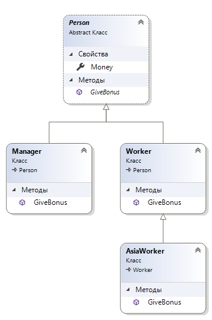

# Полиморфизм (виртуальные, абстрактные, сокрытие членов, приведение родственных классов, object)

## Виртуальные методы и их переопределение

Применение процесса переопределения методов позволяет подклассу способ определения собственной версии метода, определенном в его базовом классе. Если базовый класс желает определить метод, который можеты быть переопределен в подклассе, то он должен быть помечен ключевым словом virtual. Такие методы называются виртуальными.

Пример класса с виртуальным методом:
```csharp
public class Person
{
    public int Money { get; set; }
    public virtual void GiveBonus(int num)
    {
        Money += num;
    }
}
```
Пример переопредленеия методов в подклассах:
```csharp
class Manager : Person
{
    public override void GiveBonus(int num)
    {
        Random rnd = new Random();
        Money += num * rnd.Next(2,10); //этот жулик получает больше
    }
}
class Worker : Person
{
    public override void GiveBonus(int num)
    {
        Money += num / 10; //а этот пролетарий получает меньше
    }
}
```
Каждый переопределенный метод может задействовать стандартное поведение посредством ключевого слова base. То есть можно не заменять метод базового класса, а повторно исползовать и расширять стандартное поведение родительского класса.

Пример переопределения методов в подклассах с примененеием ключевого слова base:
```csharp
class Manager : Person
{
    public override void GiveBonus(int num)
    {
        base.GiveBonus(num);
        Money += num * 10; //больше бонусов
    }
}
class Worker : Person
{
    public override void GiveBonus(int num)
    {
        base.GiveBonus(num / 10); //меньше бонусов
    }
}
```
Можно предотвратить переопределение виртуального метода с помощью запечатывания с помощью ключевого слова sealed:
```csharp
class AsiaWorker : Worker
{
    public sealed override void GiveBonus(int num)
    {
        base.GiveBonus(num / 100); //гастарбайтерам еще меньше бонусов
    }
}
```

## Абстрактный класс

Так как базовые классы могут быть довольно расплывчатыми сущностями, то эффективно проектное решение предотвращения возможности непосредственного создания в коде нового объекта этого класса. Это достигается за счет применения абстрактного базового класса с помощью ключевого слова abstract.

Пример базового абстрактного класса:
```csharp
public abstract class Person
{
    public int Money { get; set; }
    public virtual void GiveBonus(int num)
    {
        Money += num;
    }
}
```
Хотя непосредственно создавать экземпляры абстрактноо класса невозможно, они все равно появляются в памяти при создании экземпляров производных классов.

## Полиморфные интерфейсы

Базовый абстрактный класс может определить любое количество абстрактных членов. И каждый наследник должен реализовывать навязанный ему полиморфный интерфейс. Подклассы никода не обязаны переопределять виртуальные методы со стандартной реализацией. 

Для пометки метода как абстрактного в C# используется ключевое слово abstrat. Абстрактные методы являются чистым протоколом, они определеяют имя, возвращаемый тип и набор параметров. Абстрактные методы не предоставляют никакой реализации:
```csharp
public abstract class Person
{
    public int Money { get; set; } = 0;
    public abstract void GiveBonus(int num);
}
class Manager : Person
{
    public override void GiveBonus(int num)
    {
        Money += num * 10;
    }
}
class Worker : Person
{
    public override void GiveBonus(int num)
    {
        Money += num / 10;
    }
}
```
> Абстрактные методы могут быть определены только в абстрактных классах.

Пример полиморфизма на основании этих классов:
```csharp
Person[] myPersons = {new Manager(), new Worker(), new AsiaWorker()};
foreach (var el in myPersons)
{
    el.GiveBonus(10);
    WriteLine(el.Money); // 100 1 0
}
```

>Благодаря полиморфному интерфейсу можно просто и безопасно расширять текущую иерархию. Можно добавлять дополнительные классы производные. Благодаря молиморфному интерфейсу код использующий базовый класса не потребует никаких изменений, так как компилятор обеспечивает использование только совместимых с Person типов.

## Сокрытие членов

В языке C# есть возможность сокрытия члена базового класса производным идентичным членом. Когда создается производный класс от базового, в котором определен метод, этот метод можно переопределеить сокрытием.

Пример:
```csharp
class Person
{
    public int Money { get; set; }
    public void GiveBonus(int num)
    {
        Money += num;
    }
}
class PersonThief : Person
{
    public new void GiveBonus(int num)
    {
        Money += 999 * num;
    }
}
```
Можно сокрыть свойства класса:
```csharp
class Person
{
    public int Money { get; set; }
}
class PersonThief : Person
{
    public new int Money { get; set; }
}
```
Хотя метод в производном классе переопределен, все еще доступен метод родительского класса:
```csharp
PersonThief person = new PersonThief();
person.Money = 10;
((Person) person).Money = 10;
```

 

## Приведение для базовых и производных классов

Операции приведения классов:


Любой класс является object и может трактоваться как таковой, это значит что внутри переменной типа object допускается хранить экземпляр любого объекта любого типа:

```csharp
object sample = new Manager();
Person person = new Manager();
Worker asia = new AsiaWorker();
```
Допустимая ссылка на базовый класс может хранить любой из объектов производных классов. Когда два класса связаны отношением является, то всегда можно безопасно сохранить объект производного типа в ссылке базового класса. Это называется неявным приведением.

Пример использования как неявного так и явного привдения типов:
```csharp
static void AddAge(Person person)
{
    person.Age++;
}
object sample = new Manager();
AddAge((Person)sample); //++ явное приведение типов
Person person = new Manager();
AddAge(person); //++
Worker asia = new AsiaWorker();
AddAge(asia); //++
```

Для быстрого определения совместимости одного типа с другим во время выполения в C# предусмотрено ключевое слово as. С помощью этого слова можно определить совместимость, проверив возвращаемое значение на предмет null. Если значение не null - то это совместимый тип.
```csharp
object[] its = new object[4];
its[0] = 1;
its[1] = "nothing";
its[2] = new AsiaWorker();
its[3] = new Manager();
foreach (object el in its)
{
    Person p = el as Person;
    if (p != null)
        WriteLine($"{p.Name}");
    else
        WriteLine("it is no person");
}
```

В дополнение к ключевому слову as язык C# предлагает ключевое слово is, нужное также для определения совместимости типов двух элементов, но при этом если типы не совместимы, то вместо возврата ссылки null - возврат значения false.

Пример с применением ключевого слова is:
```csharp
object[] its = new object[2];
its[0] = 1;
its[1] = new Manager();
foreach (object el in its)
{
    if (el is Manager)
        WriteLine($"{((Manager)el).Name}");
}
```
В версии C# 7 появилась возможность с помощью ключевого слова is переменной можно присваивать объект преобразованного типа, если преобразование возможно. Это позволяет убрать проблему двойного приведения.

Пример с применением присвоения переменной через is:
```csharp
object[] its = new object[2];
its[0] = 1;
its[1] = new Manager();
foreach (object el in its)
{
    if (el is Manager manager)
        WriteLine($"{manager.Name}");
}
```
>Перехват объектов всех типов с применением отбрасывания допускается применять, это полезно в конструкции switch:
```csharp
if (its[0] is var _)
{ }
```

Допускается применять сопоставление с образцом, которое было добавлено в версии C# 7. Допускается добавлять конструкцию when для более точного определения условия. Это позволяет сократить объем набираемого кода:
```csharp
object[] its = new object[3];
its[0] = 1;
its[1] = new AsiaWorker();
its[2] = new Manager();
foreach (object el in its)
{
    switch (el)
    {
        case Manager m when m.Money > 100:
            WriteLine($"Богааач {m.Name}!");
            break;
        case Manager m:
            WriteLine($"Менеджер {m.Name}");
            break;
        case AsiaWorker m:
            WriteLine($"Гастарбайтер {m.Name}");
            break;
        default:
            WriteLine("Неопределимо");
            break;
    }
}
```
>Допускается применять отбрасывание вместе с операторами switch:
```csharp
switch (el)
{
    case Manager m:
        WriteLine($"Менеджер {m.Name}");
        break;
    case Worker _: //игнор рабочих
        break;
    case null:
        WriteLine("Ошибка");
        break;
}
```

## Базовый родительский класс

В мире .NET каждый тип является производным от базового класса System.Object или object. Когда строится класс, в котором явно не указан родительский класс, он будет производным от object. 

Основные методы System.Object:

Метод Equals() - Метод возвращает истину, если сравниваемые типы ссылаются на один и тот же объект в памяти. Применяется для сравнения объектных ссылок. Но может переопределятся для сравнения значений внутреннего состояния объектов.

Метод Finalize() - Метод вызывается для освобождения любых выделенных ресурсов перед унижтожением объекта.

Метод GetHashCode() - Метод вертает int идетификатор объекта.

Метод ToString() - Метод вертает строку в формате <пространство>.<тип>. Переопределяется часто чтоб вертать "строку-значение".

Метод GetType() - Метод вертает объект Type описание объекта, на который в текущий момент производится ссылка.

Метод MemberwiseClone() - Метод вертает почленную копию текущего объекта.

>Готовое поведение System.Object может удовлетворять всем потребностям, но обычно эти методы переопределяются в унаследованных классах.

Переопределение метода System.Object.ToString() делают обычно для возвращения строки с текстовым представлением текущего состояния экземлпяра типа. Рекомендукмый подход - отделение пар "имя-занчение" друг от друга двоеточиями и помещение всей строки в квадратные скобки:
```csharp
public override string ToString() => $"[Name: {Name}; Age: {Age}; Money: {Money}]";
```
При переопределении такого метода базового класса следует использовать метод базового класса:
```csharp
public override string ToString() => base.ToString() + $" [Add: {Add}]";
```

Переопределение метода System.Object.Equals() делают чтоб работать с семантикой на основе значений. По умолчанию Equals() возвращает истину, если два сравниваемых объекта ссылаются на один и тот же экземпляр объекта в памяти. И может оказатся полезная реализация такая этого метода, чтобы возвращал истину если две сравниваемые переменные содержат те же самые значения состояния.

При переопределении прежде всего нужно проверить тип и на значение null. Пример:
```csharp
public override bool Equals(object obj)
{
    if (obj is Person person && obj != null)
    {
        if (person.Name == this.Name
            && person.Age == this.Age
            && person.Money == this.Money)
        {
            return true;
        }
    }
    return false;
}
```
>Если класс обладает подходящей реализацией метода ToString(), в которой учитываются все поля данных вверх по цепочке наследования, тогда можно просто сравнивать строковые данные объектов:
```csharp
public override bool Equals(object obj) => obj?.ToString() == ToString();
```

Переопределение метода System.Object.GetHashCode() необходимо делать в случае переопределения метода Equals() - метод должен возвращать хешкод - числовое значение, представляет которое объект как специфическое состояние. По умолчанию этот метод  применяет адрес текущей ячейки памяти, где расположен объект. Если объект будет использоватся в коллекции Hashtable, то нужно обязательно его переопределять.

Пример переопределения:
```csharp
public override int GetHashCode()
{
    return this.ToString().GetHashCode();
}
```


