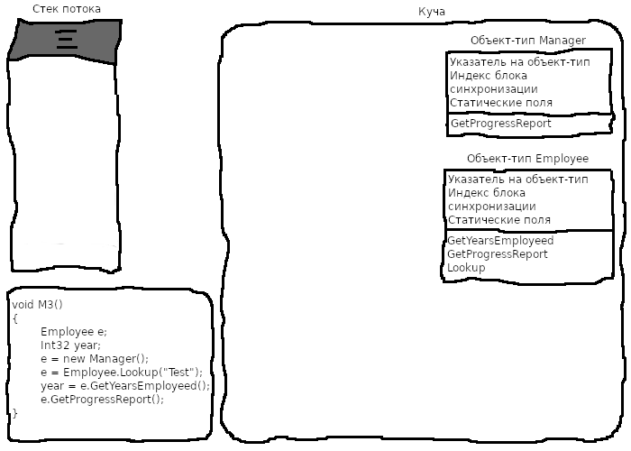

# Механизмы работы CLR

## Взаимодействие методов во время выполнения

Вначале был один процесс операционной системы с загруженной в него средой CLR. У процесса может быть несколько потоков. Потоку выделяется стек размером в 1 мегабайт. Выделенная память используется для передачи параметров в методы и хранения локальных переменных методов. Стек заполняется от области верхней памяти к области нижней памяти (от старших к младшим адресам). Вначале в стеке потока как правило уже есть какие-то данные.

 

Все методы содержат входной код инициализации и выходной код очистки, чтобы возвратить управление вызывающей программе. Вначале выполнения метода M1 выходной код выделяет в стеке память для переменной локальной test.

 

Метод М1 вызывает метод М2, передавая в качестве параметра локальную переменную. При этом адрес переменной заталкивается в стек. Внутри метода М2 местоположение стека хранится в переменной s. При вызове метода адрес возврата в вызывающий метод М1 также заталкивается в стек.

 

Вначале выполнения метода М2 его входной код выделяет в стеке потока память для локальных переменных len & tally. 

 

После выполнения кода метода команда возврата записывает в указатель команд процессора адрес возврата из стека, и стековый кадр возращается в состояние без переменных метода М2. Продолжается выполнение кода М1, следующий за вызовом метода М2, а стековый кадр возвращается в состояние, необходимое для работы метода М1. 

 

После выполнения метода М1 команда возврата устанавливает указатель команд на адрес возврата, которая находится над переменнтой test в стеке. Продолжается выполнение кода сразу за вызовом метода М1 в вызывающей программе, стековый кадр находится в состоянии, необходимом для его работы.

 

## Взаимодействие классов во время выполнения

Определены следующие определения классов:

```csharp
internal class Employee 
{
    public Int32 GetYearsEmployed() {}
    public virtual String GetProgressReport() {}
    public static Employee Lookup(String name) {}
}
internal sealed class Manager : Employee
{
    public override String GetProgressReport() {}
}
```

Все объекты в куче должны содержать два дополнительных члена - указатель на объект-тип и индекс блока синхронизации. Статические поля данных выделяются в составе самих объектов-типов. У каждого объекта-типа есть таблица методов с входными точками всех методов, определенных в типе. В типе Employee - три метода, а в типе Manager - один метод.

Вначале был один процесс операционной системы с загруженной в него средой CLR. Инициализирована управляемая куча, создан поток с 1 мб памяти в стеке. Из внешней программы вызывается метод М3. 

 

В процессе преобразования IL-кода метода М3 в машинные команды JIT-компилятор выявляет все типы, на которые есть ссылки в М3. CLR обеспечивает заргузку в домент приложений всех сборок с этими типами. Затем на основе метаданных сборки CLR создает структуры данных, представляющие эти типы.

 

После создания всех необходимых для метода объекты-типы и компилирования кода метода М3 CLR начинает выполнять код М3. Вначале в стеке потока выделяется память для локальных переменых. CLR автоматически инициализирует все локальные переменные значением null или 0.

 

Код метода М3 создает объект Manager - экземпляр типа Manager. У объекта есть указатель на объект-тип и индекс блока синхронизации, место для размещения всех экзеплярных полей данных, а также всех экзеплярных полей, определенных во всех базовых классах типа Manager (Employee и Object). CLR инициализирует индекс блока синхронизации и присваивает всем экземплярным полям объекта значение null и 0. Оператор new возвращает адрес в памяти объекта Manager. 

 

Код метода М3 вызывает статический метод Lookup объекта Employee. При этом CLR определяет местонахождение объекта-типа, в котором определен статический метод, затем находит точку входа в вызываемый метод и передает управление полученному от JIT-компилятора коду. Lookup создает в куче новый объект Manager, инициализирует его переданным в параметре значением и возвращает адрес готового объекта. Адрес помещается в локальной переменной e.

 

Код метода М3 вызывает невиртуальный экземплярный метод GetYearsEmployeed в Employee и возвращает значение 5.  

 

Код метода М3 вызывает виртуальный экземплярный метод GetProgressReport в Employee. При вызове такого метода CLR обращается к переменной, используемой для вызова и затем следует по адресу вызывающего объекта. CLR проверяет у объекта внутренний указатель на объект-тип, находит в таблице методов объекта-типа запись вызываемого метода, и вызывает скомпилированный JIT-компилятором метод. Вызывается реализация GetProgressReport в Manager, потому как e ссылается на объект Manager.

 

Объекты Employee и Manager содержат указатели на объект-тип System.Type. А сам объект-тип System.Type является объектом и поэтому содержит указатель на самого себя. При своем запуске CLR сразу же создает специальный объект-тип для типа System.Type.


